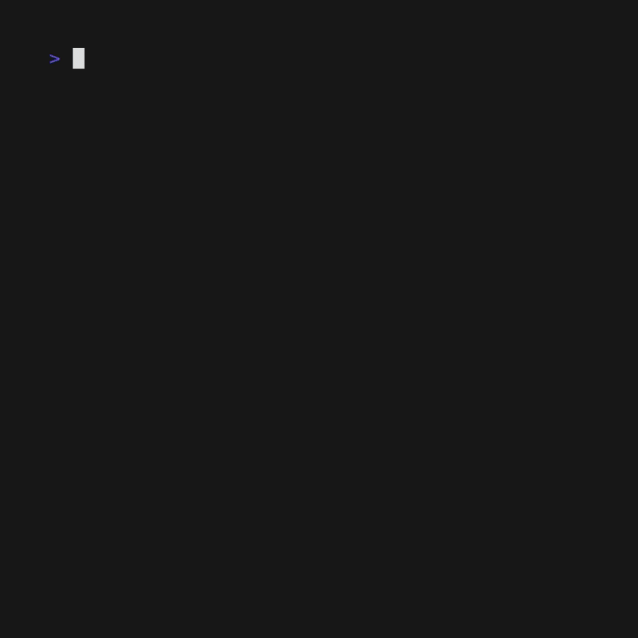

# To Do CLI

I built a terminal-based todo app built with [Bubble Tea](https://github.com/charmbracelet/bubbletea).



## Requirements

- Go 1.22+

## Setup

```
go build -0 todo . && ./todo
```

# Controls

## Input View

| Key      | Action         |
| -------- | -------------- |
| `enter`  | Add todo       |
| `tab`    | Switch to list |
| `ctrl+c` | Quit           |

## List View

| Key       | Action              |
| --------- | ------------------- |
| `j` / `↓` | Move down           |
| `k` / `↑` | Move up             |
| `tab`     | Switch to input     |
| `space`   | Mark todo done      |
| `ctrl+e`  | Edit current todo   |
| `ctrl+d`  | Delete current todo |
| `ctrl+c`  | Quit                |

## Roadmap

- [ ] Time tracking — start a timer when a task begins, stop it when marked done
- [ ] Per-day todo lists — automatically archive yesterday's list and start fresh each day
- [ ] Analytics — completion rates, time per task, weekly/monthly stats
- [x] Better UI/UX

## License

MIT
